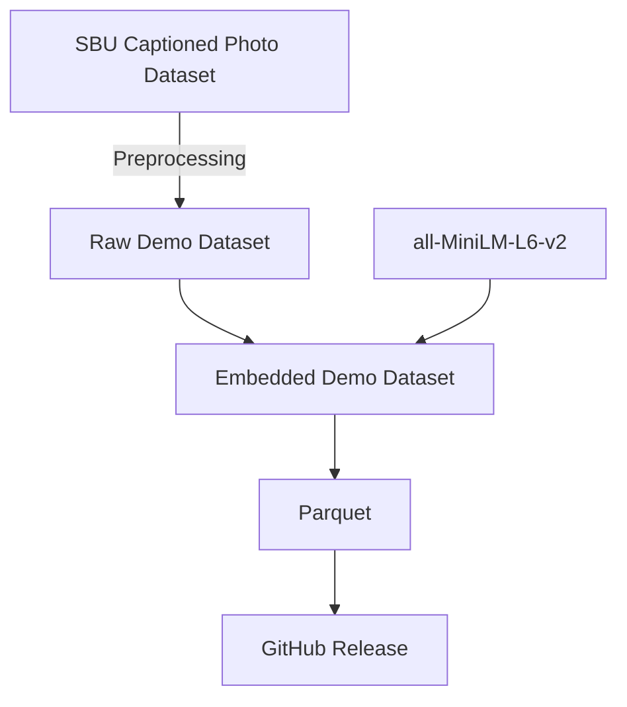

# Vectoria Demo

This is a demo app to showcase Vectoria. It is a semantic search for images.

From the demo folder, run the following:
```sh
# compose v2 
docker compose run

# compose v1
docker-compose run
```

The quality of the results depends on the embedding model and dataset, so try swapping them out for better performance.

## Data Preparation

As a starting point, we chose [SBU Captioned Photo Dataset](https://huggingface.co/datasets/sbu_captions), which is a collection of captions and images from Flickr.
A subset of the dataset was randomly selected and preprocessing steps applied, then we used the [all-MiniLM-L6-v2](https://huggingface.co/sentence-transformers/all-MiniLM-L6-v2) to generate the embeddings for the associated captions.



Preprocessing steps:
- Random Subset Selection: About 10% of the dataset (100k data points) was sampled.
- URL validation: Removed data points with invalid URLs.
- Maximum Sequence Length: Removed data points exceeding the max sequence length (the model truncates, which can affect retrieval performance).

To reproduce, run `data/main.py`. It will take a while.