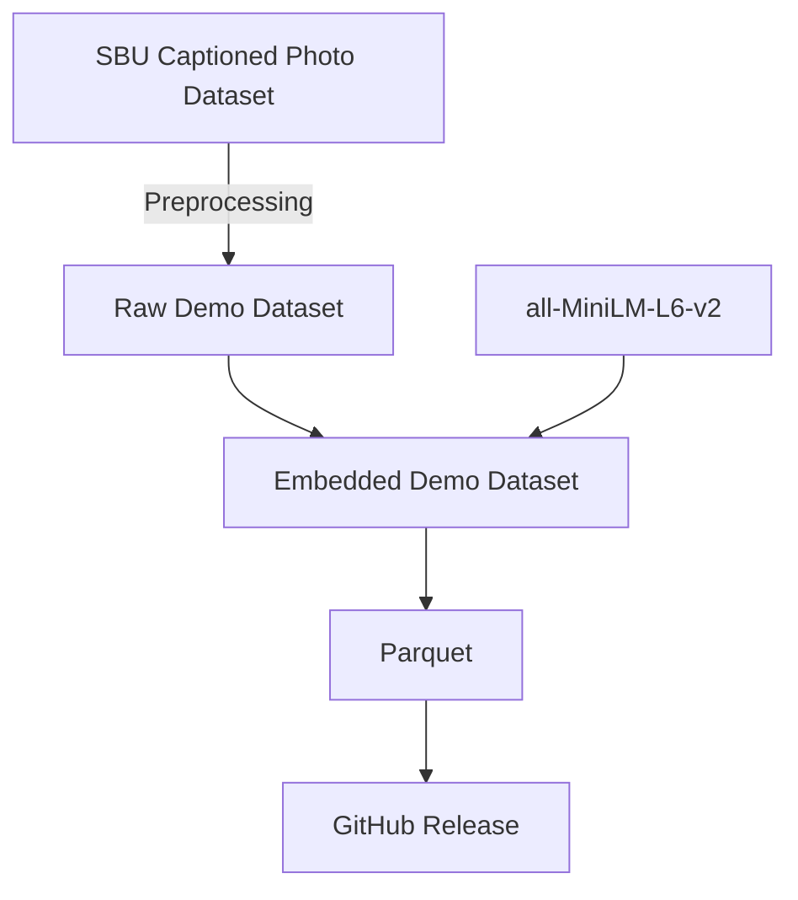

# Vectoria Demo

This is a demo app to showcase Vectoria. It is a semantic search for images.

TODO: Limitations.

## Data Preparation

As starting point We chose [SBU Captioned Photo Dataset](https://huggingface.co/datasets/sbu_captions), which is a collection of captions and images from Flickr.
A subset of the dataset was randomly selected and preprocessing steps applied, then we used the [all-MiniLM-L6-v2](https://huggingface.co/sentence-transformers/all-MiniLM-L6-v2) to generate the embeddings for the associated captions.

Preprocessing steps:
- Random Subset Selection: About 10% of the dataset was sampled (100k data points).
- URL validation: Data points with invalid URLs were removed.
- Maximum Sequence Length: Data points with sequence length greater than the maximum were removed (by default the model truncates, which could impact the retrieval performance later on).

To reproduce, run `data/main.py`. It will take a while.